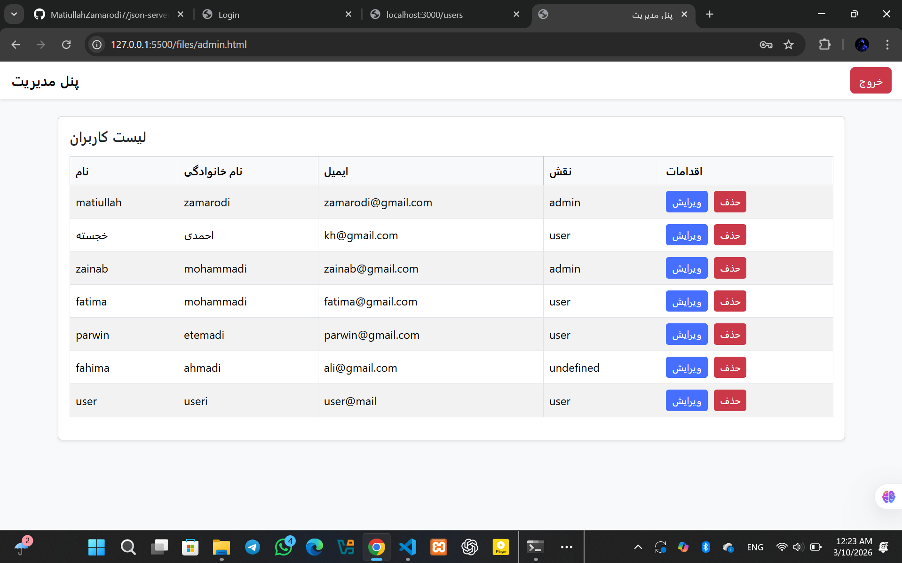

### this is the json project and first take the all prohect from my github then go and start the json server then run the prj
## 1 : install npm
## 2 : take the prj from my github
## 3 : the go and run the npm 
## 4 : then in npm write this 
## 5 : npx json-server db.json --watch ---> this start the json server
## 6 : then go and start the prj

---
🚀 **Live Demo:**  
# Todo List Project

This is my Todo List project.

---
